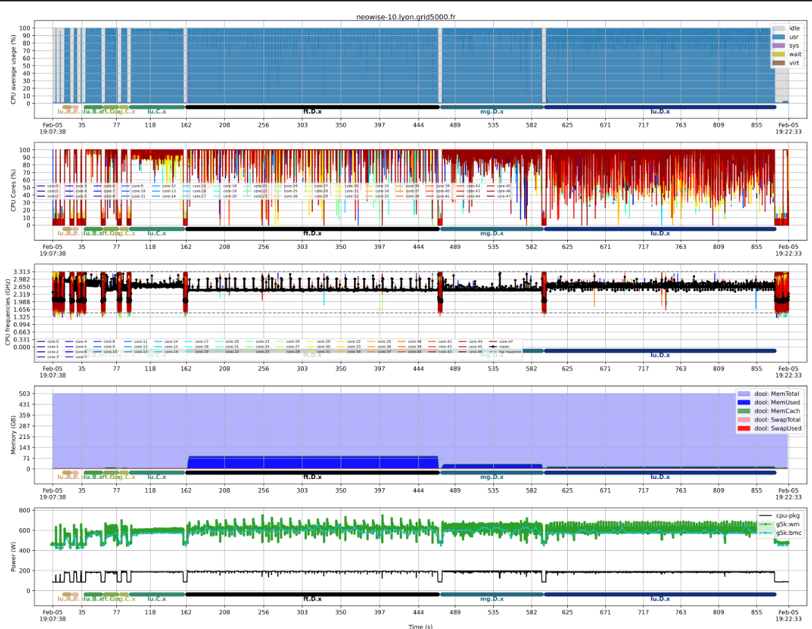

# benchmon - SDP Benchmark Monitor

This repository contains the benchmark monitor that is used in conjunction with the [benchmark tests repository](https://gitlab.com/ska-telescope/sdp/ska-sdp-benchmark-tests)

## Installation
```bash
git clone https://gitlab.com/ska-telescope/sdp/ska-sdp-benchmark-monitor.git
cd ska-sdp-benchmark-monitor

# within a venv (not mandatory but recommended)
pip install .
```
This will install ska-sdp-benchmark-monitor in your python environment and append  executables to the path.

## Getting started
benchmon allows for background monitoring of resource usage, recording of energy consumption, and tracing of the callgraph. The capabilities of each mode are detailed below
#### Resource usage
- Average CPU usage;
- Per-Core CPU usage;
- CPU frequencies;
- Memory and swap utilization;
- Network and infiniband bandwidths;
- Disk bandwidth and IOPS.
#### Energy consumption
- RAPL measurements with `perf`.
- Wattmeter measurements of Grid5000 wattmetres and BMCs.
#### Callgraph tracing
- Call graph tracing with `perf record` to annotate plots, view callstack or generate flame graphs.
## Run benchmon
#### Procedure
To run benchmon,
1. Before running target applications:
	- Start with `benchmon-start` for a mono-node run.
	- Start with `benchmon-multinode-start` for a multi-node run
2. Run target applications
3. After the applications have finished:
	- Stop with `benchmon-stop` for a mono-node run.
	- Stop with `benchmon-multinode-stop` for a multi-node run.
Upon completion, several reports will be saved in the traces directory, which can be visualized using the `benchmon-visu` described below.
#### Options
Additional options/flags available for the monitoring modes are described as follows:
  - `-d | --save-dir`: Traces repository (default: `./save_dir_<JobId>/`). For each compute nodes, a sub-repository will be created in and named `benchmon_traces_<hostname>`.
 -  `-v | --verbose`: Enable verbose mode.
###### Resource usage monitoring
- `--system | --sys`: Enable system monitoring
- `--sys-freq`: Monitoring frequency (Default: 10 Hz)
###### Energy consumption
- `--pow | --power`: Enable power monitoring (with perf and g5k).
- `--pow-sampl-intv | --power-sampling-interval`: Sampling interval to collect power metrics (default: `250` milliseconds).
- `--pow-g5k | --power-g5k`: Enable Grid5000 power monitoring.
###### Call graph tracing
- `--call`: Enable callstack tracing.
- `--call-mode`: Call graph collection mode (`dwarf`; `lbr`; `fp`) (default: `dwarf,32`)
- `--call-prof-freq | --call-profiling-frequency`: Profiling frequency (default: 10 Hz, min: 1 Hz)
#### Pre-defined levels
Pre-defined levels gather a set of benchmarking aspects to cover. They could be used as follows
```bash
benchmon-start --level <level> --save-dir <dir>
<target-app>
benchmon-stop --level <level> --save-dir <dir>
```
That generates automatically the visualization figures.

The pre-defined levels are set as follows:
- `--level 0`: `--sys --sys-freq 1`
- `--level 1`: `--sys --sys-freq 5 --call --call-prof-freq 2`
- `--level 2`: `--sys --sys-freq 100 --call --call-prof-freq 50`

## Visualization
The visualization tool `benchmon-visu` allows for partial and complete display of resource usage, power and call tracing data. It takes the traces repository as a positional arguments (if unset, it takes `./`) and optional flags for the desired metrics. Here is the list of flags and options:

##### Resource usage monitoring
- `--mem`: Visualize memory
- `--cpu`: Display average cpu usage per space (usr, sys, wait, idle, virt)
- `--cpu-all`: Visualize all CPU cores usage (usr+sys+wait)
- `--cpu-freq`: Visualize all CPU cores frequencies
- `--cpu-cores-full` Display core usage per space (comma-separated list)
- `--cpu-cores-in`: List of comma-separated CPU cores to display.
- `--cpu-cores-out`: List of comma-separated CPU cores to exclude.
- `--net`: Visualize the network activity.
- `--net-all`: Visualize all active network interfaces.
- `--net-rx-only`: Visualize only rx activity.
- `--net-tx-only`: Visualize only tx activity.
- `--net-data`: Label network plot with the total networked data.
- `--disk`: Visualize disk activity (bandwidth).
- `--disk-iops`: Visualize the IOPS of the disks.
- `--disk-data`: Label plots with the total size of date operated by the disks.
- `--disk-rd-only`: Visualize disk reads only.
- `--disk-wr-only`: Visualize disk writes only.
- `--ib`: Visualize infiniband activity
##### Energy consumption
- `--pow`: Visualize perf power profiles.
- `--pow-g5k`: Visualize G5K power profiles.
##### Callstack tracing
- `--inline-call`: Annotate the plots with running commands.
- `--call`: Visualize the call stack.
- `--call-depth`: Set the call stack depth.
##### Global visualization options
- `--recursive`: Generate a sync plot for multi-node runs.
- `--interactive`: Enable interactive visualization (with matplotlib).
- `--start-time`: Optional start time (in format: `"YYYY-MM-DDTHH:MM:SS"`.
- `--end-time`: Optional end time (in format: `"YYYY-MM-DDTHH:MM:SS"`).
- `--fig-path`: Set the directory where to save the fig (default: same as traces)
- `--fig-fmt`: Set the figure format (default: `svg`).
- `--fig-name`: Set the figure name (default: `benchmonpsc_fig`)
- `--fig-dpi` Set the quality of figure: `low`, `medium`, `high` (default: `medium`).
## Mono-node example
```bash
#!/usr/bin/bash

# Benchmon-run parameters
traces_repo=./traces_$JOBID
benchmon_params="--save-dir $traces_repo"
benchmon_params+=" --sys --sys-freq 5"                      # Resource monitoring enabled
benchmon_params+=" --power --power-sampling-interval 100 "  # Power profiling enabled
benchmon_params+=" --call --call-prof-freq 5"               # Callstack recording enabled
benchmon_params+=" --verbose"

# Run benchmon
benchmon-start $benchmon_params
sleep 2

# Target app
mpirun -n $SLURM_NPROCS <target-app>

# Stop benchmon
sleep 2
benchmon-stop

# Create visualization plot
benchmon-visu --mem --cpu --cpu-all --cpu-freq \
			--cpu-cores-in 1,2,3,4 --fig-fmt png --fig-dpi medium --recursive $traces_repo
```

## Multi-node example on slurm
```bash
#!/usr/bin/bash
#SBATCH -N 2 -n 8 -t 10

# Benchmon-run parameters
traces_repo=./traces_${SLURM_JOB_ID}
benchmon_params="--save-dir $traces_repo"
benchmon_params+=" --sys --sys-freq 5"
benchmon_params+=" --verbose"

# Run benchmon
benchmon-multinode-start $benchmon_params
sleep 2

# Target app
mpirun -n $SLURM_NPROCS <target-app>

# Stop benchmon
sleep 2
benchmon-multinode-stop

# Create visualization plot
benchmon-visu --mem --cpu --cpu-all --cpu-freq --net --disk \
		--cpu-cores-in 1,2,3,4 --fig-fmt png --fig-dpi medium --recursive $traces_repo
```
## Example on AWS (with level)
```bash
#!/usr/bin/bash
#SBATCH -N 2 -n 8 -t 10

# Run benchmon
BENCHMON_LEVEL=1
benchmon-multinode-start --level $BENCHMON_LEVEL
sleep 2

# Target app
mpirun -n $SLURM_NPROCS /shared/fsx1/benchmark-monitor/mytest/nas-mpiomp/bin/ft.B.x

# Stop benchmon
sleep 2
benchmon-slurm-stop --level $BENCHMON_LEVEL
```

## Visualization example

