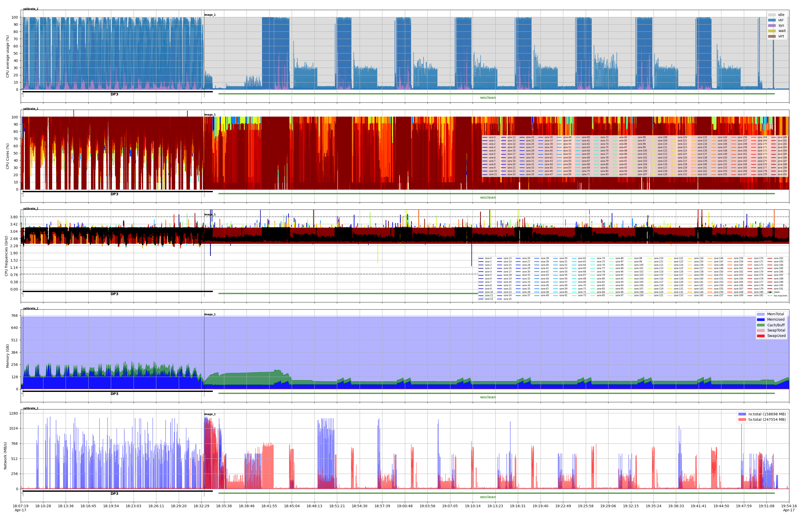

# Self-Calibration Pipeline
This example demonstrates how to use benchmon to monitor and visualize the performance of a self-calibration (ICAL) pipeline. It sets up the environment, starts benchmon monitoring, runs the `ska-sdp-wflow-selfcal` workflow, and then stops monitoring. Finally, it generates detailed visualizations of system resource usage (CPU, memory, network) and annotates them with relevant pipeline stages and commands, providing insights into the workflow's performance characteristics.

| Number of nodes  |        1         |
| ---------------- | :--------------: |
| CPU Model        | Intel Xeon 8488C |
| CPUs             |        2         |
| Cores per CPU    |        48        |
| Threads per core |        2         |
| Memory           |     768 GiB      |
| Storage          |    Lustre FSX    |

```bash
#!/usr/bin/bash

### SOFTWARE ENVIRONMENT #################################################################
# < Load the necessary modules or activate the environment>
##########################################################################################

### START BENCHMON #######################################################################
save_dir=$WORK_DIR/benchmon_savedir_$SLURM_JOB_ID
benchmon_params="--save-dir $save_dir"
benchmon_params+=" --high-freq-system --hf-sys-freq 10"
benchmon_params+=" --call --call-prof-freq 1"
benchmon_params+=" --verbose"
benchmon-multinode-start $benchmon_params
##########################################################################################

sleep 20

### RUN ##################################################################################
 ska-sdp-wflow-selfcal \
  --dp3_path $(which DP3) \
  --wsclean_cmd $(which wsclean) \
  --input_ms $INPUT_MS \
  --work_dir $WORK_DIR \
  --config $ICAL_CONFIG \
  --ignore_version_errors True \
  --resume_from_operation calibrate_1 \
  --run_single_operation False
##########################################################################################

sleep 20

### STOP BENCHMON ########################################################################
benchmon-stop
##########################################################################################

### BENCHMON VISU ########################################################################
cp $WORK_DIR/wflow-selfcal.*.log $save_dir/benchmon_traces_<fullname>  # Copy the log file to the save directory
benchmonvisu_params="--verbose --fig-fmt png"           # Enable verbosity and set figure format
benchmonvisu_params+=" --cpu --cpu-all --cpu-freq"      # Display CPU usage, all cores and frequencies
benchmonvisu_params+=" --mem"                           # Display memory and swap usage
benchmonvisu_params+=" --net --net-data"                # Display network activity for all interfaces and data
benchmonvisu_params+=" --inline-call"                   # Annotate plots with running commands
benchmonvisu_params+=" --inline-call-cmd DP3,wsclean"   # Annotate plots only with DP3 and wsclean commands
benchmonvisu_params+=" --annotate-with-log ical"        # Annotate plots with ICAL stages for the log file `wflow-selfcal.*.log`
benchmonvisu_params+=" --fig-width 31 --fig-height-unit 4 --fig-xrange 35"  # Set figure dimensions and x-range
benchmonvisu_params+=" --recursive"
benchmon-visu $benchmonvisu_params $save_dir
##########################################################################################
```
The figure below illustrates the first iteration of the ICAL pipeline, highlighting two main stages: `calibrate_1` and `image_1`, as indicated by the dashed vertical bars. The `calibrate_1` stage is primarily composed of `DP3`. In the `image_1` stage, there is an initial brief use of `DP3`, followed by a phase dominated by `wsclean`. Within this phase, eight prominent patterns are visible, corresponding to the major loops of the imaging.

