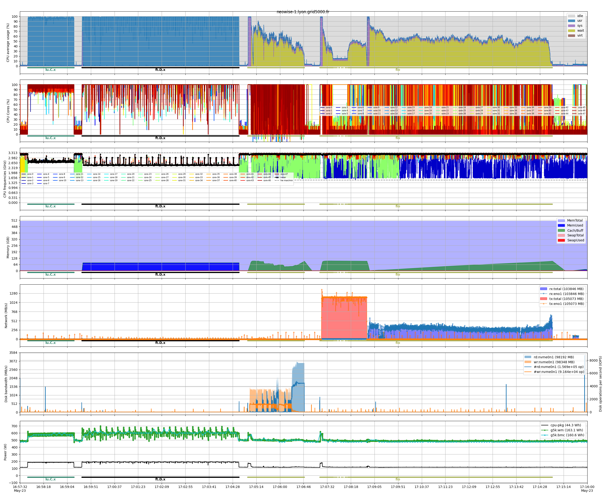

# Mono-node example
This example demonstrates how to use the `benchmon` tool to monitor and analyze the performance of a single-node system while running a series of computational and I/O benchmarks. The script starts by configuring and launching `benchmon` with various monitoring options, including system metrics, power consumption, and call stack tracing. It then executes two computational benchmarks (`lu.C.x` and `ft.D.x`), followed by I/O benchmarks using `fio` on both local and NFS storage. After the benchmarks complete, `benchmon` is stopped, and visualization commands are provided to generate detailed performance plots for further analysis.

| Number of nodes  |       1       |
| ---------------- | :-----------: |
| CPU Model        | AMD EPYC 7642 |
| CPUs             |       1       |
| Cores per CPU    |      48       |
| Threads per core |       1       |
| Memory           |    512 GiB    |
| Network          |  IB 100 Gbps  |
| Disk             |   SSD NVME    |

```bash
#!/usr/bin/bash


### benchmon start ################################################################################
save_dir="./traces_doc_mono_$(date +%s)"
benchmon_params="--save-dir $save_dir"
benchmon_params+=" --sys --sys-freq 10"         # System monitoring with 10Hz frequency
benchmon_params+=" --power"                     # Power monitoring with perf
benchmon_params+=" --call --call-prof-freq 10"  # Callstack tracing with 10Hz frequency
benchmon_params+=" --verbose"                   # Enable verbosity
benchmon-start $benchmon_params
###################################################################################################


### run apps ######################################################################################
interval=15 # Interval between each benchmark
sleep $interval

export OMP_NUM_THREADS=$(nproc)

# LU benchmark
./lu.C.x

sleep $interval

# FT benchmark
./ft.D.x

# Params of IO benchmarks
njobs=$(nproc)
nrfiles=4
fsize=2G

# Local storage read and write
local_tmpdir=$(mktemp -dp /tmp)
fio --name=fio_test --ioengine=sync --rw=write --bs=1M --size=$fsize --numjobs=$njobs --nrfiles=$nrfiles --directory=$local_tmpdir
fio --name=fio_test --ioengine=sync --rw=read --bs=1M --size=$fsize --numjobs=$njobs --nrfiles=$nrfiles --directory=$local_tmpdir

sleep $interval

# NFS storage read and write
nfs_tmpdir=$(mktemp -dp ~/storage-lyon.link/tmp/)
fio --name=fio_test --ioengine=sync --rw=write --bs=1M --size=$fsize --numjobs=$njobs --nrfiles=$nrfiles --directory=$nfs_tmpdir
fio --name=fio_test --ioengine=sync --rw=read --bs=1M --size=$fsize --numjobs=$njobs --nrfiles=$nrfiles --directory=$nfs_tmpdir

sleep $interval
###################################################################################################


### benchmon stop #################################################################################
benchmon-stop
###################################################################################################


### benchmon visu #################################################################################
benchmonvisu_params="--verbose --fig-fmt png --fig-name myfigure"   # Enable versbosity and set figure format and name
benchmonvisu_params+=" --cpu --cpu-all --cpu-freq"                  # Dispplay CPU usage, all cores and frequencies
benchmonvisu_params+=" --net --net-all --net-data"                  # Display network activity for all interfaces and data
benchmonvisu_params+=" --mem"                                       # Display memory and swap usage
benchmonvisu_params+=" --disk --disk-data --disk-iops"              # Display disk activity and IOPS
benchmonvisu_params+=" --pow"                                       # (Perf) Display power profiles and energy consumption
benchmonvisu_params+=" --inline-call"                               # Annotate plots with running commands
benchmonvisu_params+=" --recursive"                                 # Generate synchronized plots for multi-node runs
benchmon-visu $benchmonvisu_params $save_dir
###################################################################################################
```
The figure generated by benchmon illustrates the system's behavior during the benchmarks. For the two computational benchmarks, `ft.D.x` and `lu.C.x`, the CPU usage reaches full capacity, reflecting their efficient optimization. The I/O benchmarks performed with `fio` highlight increased CPU `wait` times during I/O operations. This activity is visible in the disk graph for the local storage benchmark, while the network interface graph shows the activity for the NFS-based benchmark, as data is transferred over the network. The power consumption graph indicates higher energy usage during the computational benchmarks and lower consumption during the I/O benchmarks, since the latter are less CPU-intensive.

