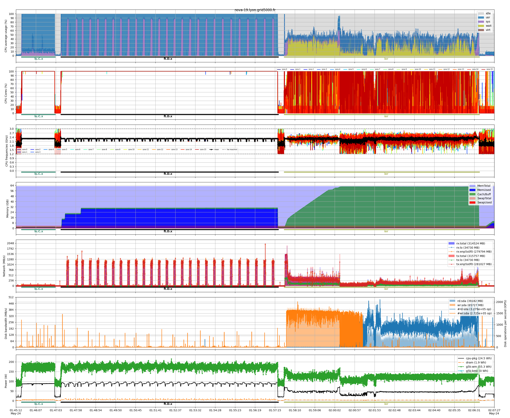

# Multi-node example
This script automates the process of benchmarking distributed applications across multiple nodes using the benchmon monitoring suite. It begins by configuring and starting benchmon to collect detailed system, power, and callstack metrics at specified intervals. The script then sequentially runs three benchmarks (LU, FT, and IOR) using mpirun across a set of hosts, with pauses between each run to ensure accurate measurements. After all benchmarks complete, the script stops the monitoring and generates visualizations of the collected data, including CPU, memory, network, disk, and power usage, with annotated plots for each benchmarked command.

| Number of nodes  |        4        |
| ---------------- | :-------------: |
| CPU Model        | Intel Xeon 2620 |
| CPUs             |        2        |
| Cores per CPU    |        8        |
| Threads per core |        1        |
| Memory           |     64 GiB      |
| Network          |  ETH 100 Gbps   |
| Disk             |       HDD       |

```bash
#!/usr/bin/bash

### benchmon start ################################################################################
save_dir="./traces_doc_multi_$(date +%s)"
benchmon_params="--save-dir $save_dir"
benchmon_params+=" --sys --sys-freq 10"         # System monitoring with 10Hz frequency
benchmon_params+=" --power"                     # Power monitoring with perf
benchmon_params+=" --call --call-prof-freq 10"  # Callstack tracing with 10Hz frequency
benchmon_params+=" --verbose"                   # Enable verbosity
benchmon-multinode-start $benchmon_params
###################################################################################################


### run apps ######################################################################################
interval=15 # Interval between each benchmark
sleep $interval

host=<hosts> # comma-separated list of hosts for mpirun

# LU benchmark
mpirun --tag-output --host $host ~/apps/npb/mpi/lu.C.x

sleep $interval

# FT benchmark
mpirun --tag-output --host $host ~/apps/npb/mpi/ft.D.x

sleep $interval

# IOR benchmark
tmpdir=$(mktemp -dp /mnt/beeond)
cd $tmpdir
mpirun --tag-output --host $host ~/apps/ior/ior -b 2G -s 4 -F -i 1 -w -r
cd -

sleep $interval
###################################################################################################


### benchmon stop #################################################################################
benchmon-multinode-stop
###################################################################################################


### benchmon visu #################################################################################
benchmonvisu_params="--verbose --fig-fmt png --fig-name myfigure"   # Enable versbosity and set figure format and name
benchmonvisu_params+=" --cpu --cpu-all --cpu-freq"                  # Display CPU usage, all cores and frequencies
benchmonvisu_params+=" --net --net-all --net-data"                  # Display network activity for all interfaces and data
benchmonvisu_params+=" --mem"                                       # Display memory and swap usage
benchmonvisu_params+=" --disk --disk-data --disk-iops"              # Display disk activity and IOPS
benchmonvisu_params+=" --pow"                                       # (Perf) Display power profiles and energy consumption
benchmonvisu_params+=" --inline-call"                               # Annotate plots with running commands
benchmonvisu_params+=" --inline-call-cmd ft.D.x,lu.C.x,ior"         # Annotate plots with these specific commands
benchmonvisu_params+=" --recursive"                                 # Generate synchronized plots for multi-node runs
benchmon-visu $benchmonvisu_params $save_dir
###################################################################################################
```
The two figures below illustrate the results of the multi-node benchmarking process. The first figure provides a detailed view of the resource usage and performance metrics collected on the master node, including CPU, memory, network, disk, and power consumption, with annotations marking the execution of each benchmarked command. The second figure presents a synchronized overview across all nodes, allowing for a comparative analysis of system behavior and performance during the distributed benchmarks. These visualizations are generated by `benchmon-visu`, which produces both per-node detailed figures and an additional figure summarizing node synchronization.
## Master node
The figure above shows the resource usage on the master node during the execution of the three benchmarks. During the `lu.C.x` run, CPU usage reaches its maximum, with only a small portion attributed to system CPU, indicating limited inter-node communication. The `ft.D.x` benchmark also drives CPU usage to its peak, but with a noticeable increase in system CPU usage, reflecting frequent collective communications between nodes—this is further corroborated by the elevated network activity observed in the network plot. For the `ior` benchmark, there is a significant amount of CPU wait time, consistent with its I/O-intensive nature; corresponding write and read operations are clearly visible in the disk activity plot. The energy plot highlights a high power profile throughout the CPU-intensive benchmarks, illustrating the increased energy consumption during these workloads.


## Synchronized nodes
The synchronized plot aggregates metrics across all nodes, providing a view of distributed resource usage. The CPU plot displays the average CPU utilization for each node, along with the overall mean across nodes. The memory plot shows the total memory usage per node in distinct colors, with a dashed line indicating the sum of all nodes' memory usage. Network and disk plots illustrate the individual bandwidths (rx/tx and rd/wr) for each node, as well as the cumulative bandwidths, highlighting the distributed and collective behavior during the benchmarks.

