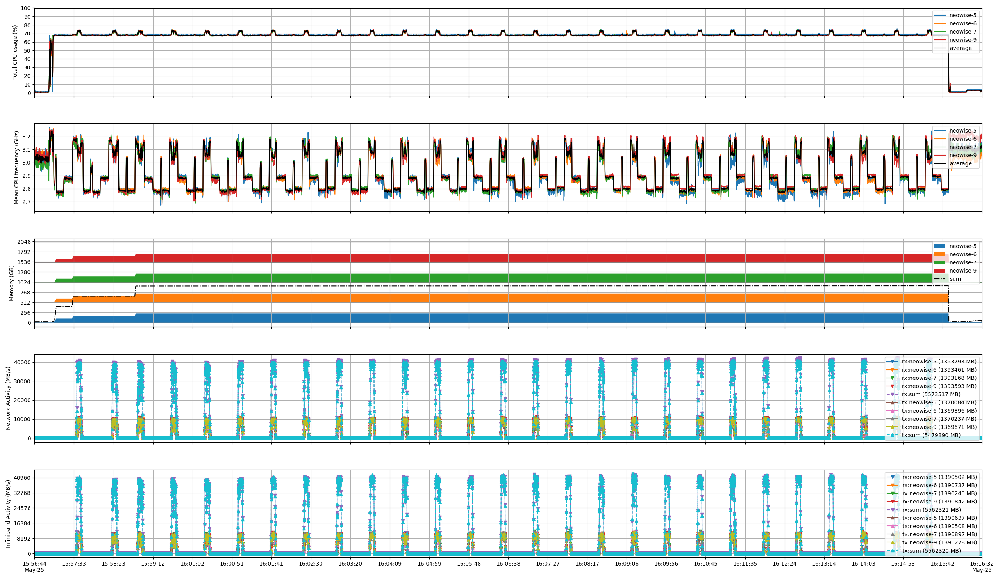

# Pre-defined level benchmark
This example demonstrates how to use `benchmon` with pre-defined levels for running the `ft.D.x` benchmark in a multi-node environment. The script shows how to start monitoring with a specified level, execute the FT benchmark application, and then stop monitoring. It generates output files for both hardware and software contexts, along with detailed and overview monitoring figures for each node.

| Number of nodes  |       4       |
| ---------------- | :-----------: |
| CPU Model        | AMD EPYC 7642 |
| CPUs             |       1       |
| Cores per CPU    |      48       |
| Threads per core |       1       |
| Memory           |    512 GiB    |
| Network          |  IB 100 Gbps  |

```bash
#!/usr/bin/bash -x

### benchmon start ################################################################################
save_dir="./traces_doc_multi_$(date +%s)"
level=1
benchmon-multinode-start --level $level --save-dir $save_dir
###################################################################################################


### run apps ######################################################################################
interval=5
sleep $interval

host=<hosts> # comma-separated list of hosts for mpirun
mpirun --tag-output --mca btl ofi --mca pml ucx --host $host ~/apps/npb/mpi/ft.D.x

sleep $interval
###################################################################################################


### benchmon stop ##################################################################################
benchmon-multinode-stop --level $level --save-dir $save_dir
####################################################################################################
```
## Overview figure
The overview figure generated by benchmon summarizes the resource usage of the master node, including average CPU usage per space, memory utilization, network activity, and disk activity.


## Detailed figure
The detailed figure generated by benchmon provides a more granular view than the overview figure. It displays individual CPU usage, CPU frequencies, network activities per interface as well as total network data, and disk activity per disk block along with total data operated.


## Synchronized figure
As the run is a multi-node run, we can run
```bash
benchmon-visu --cpu --cpu-freq --mem --net --ib --recursive $save_dir
```
to obtain a synchronized resource usage figure from all nodes. This figure aligns the monitoring data across nodes.

